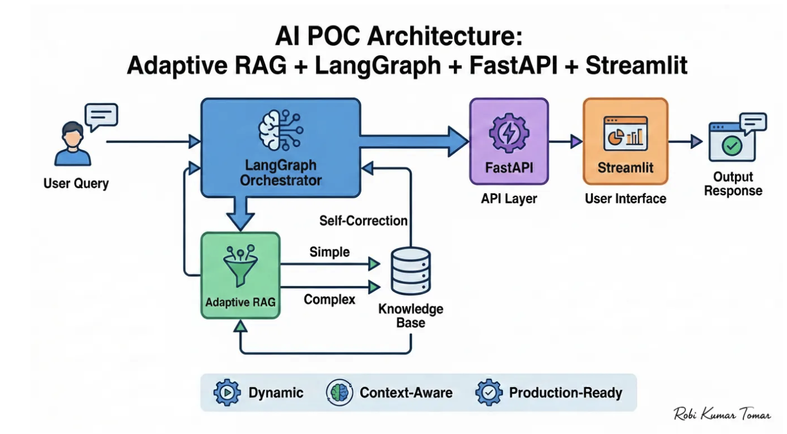
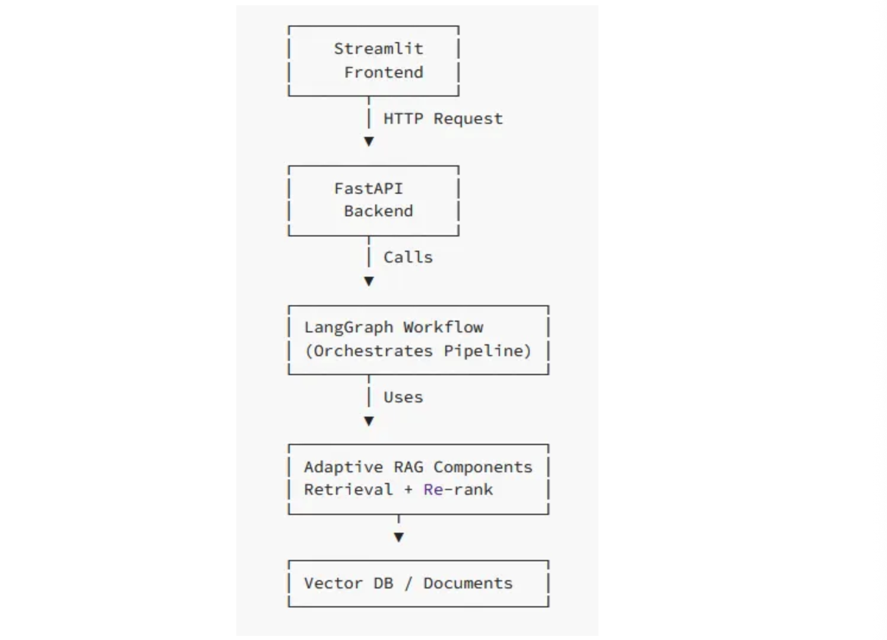

https://medium.com/@robi.tomar72/build-a-full-poc-using-adaptive-rag-langgraph-fastapi-streamlit-complete-step-by-step-guide-ab8631ae5dcb







#### 프로세스 흐름도
```
User → Query → Streamlit UI
Streamlit → Sends request → FastAPI
FastAPI → Passes query → LangGraph
LangGraph → Runs Adaptive RAG → Retriever
Retriever → Gets chunks → Vector DB
Vector DB → Returns results → LangGraph
LangGraph → Generates final response
FastAPI → Sends to UI → User
```

### 폴더 구조
```
ai-poc/
│
├── backend/                      # Backend logic
│   ├── app.py                    # FastAPI API server
│   ├── rag_pipeline.py           # Adaptive RAG retrieval
│   ├── graph_workflow.py         # LangGraph workflow
│   ├── config.py                 # Config & environment setup
│   ├── data/                     # Source documents
│   └── __init__.py               # Package initializer
│
├── frontend/                     # UI layer
│   ├── ui.py                     # Streamlit interface
│   └── __init__.py               # Package initializer
│
├── .env                          # API keys & secrets
├── requirements.txt              # Project dependencies
└── README.md                     # Setup instructions

```


### 실행
```
uvicorn backend.app:app --reload

streamlit run frontend/ui.py


```