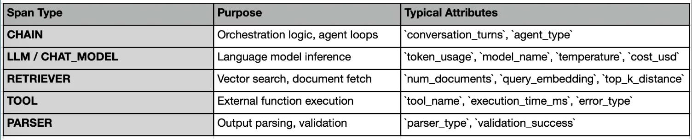
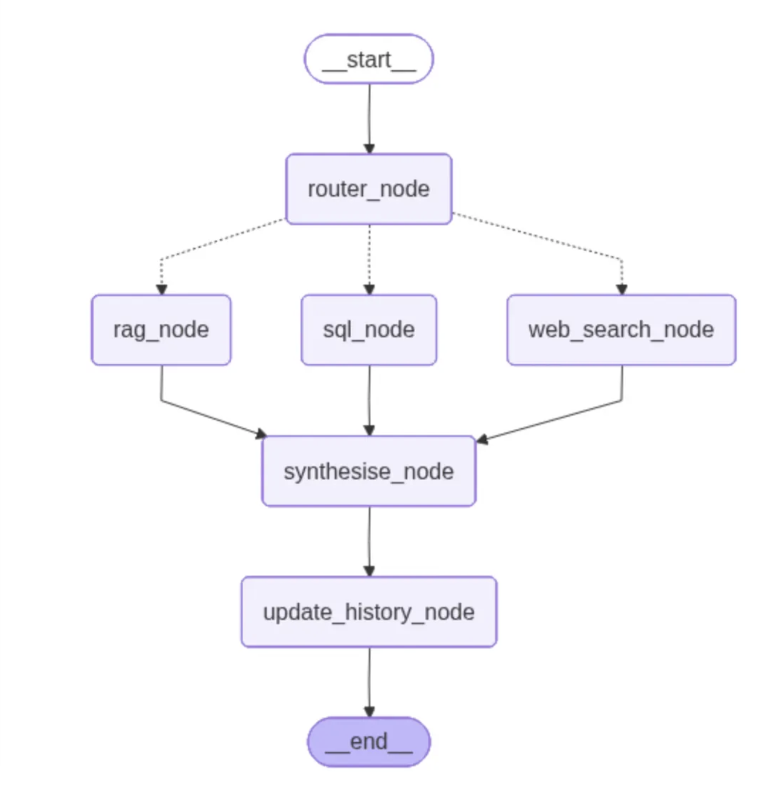

https://pub.towardsai.net/mlflow-observability-for-generative-ai-a-deep-dive-with-text2sql-rag-websearch-using-langgraph-2430c502adfa

MLflow의 추적 시스템은 다음 세 가지 핵심 구성 요소를 통해 이러한 모든 문제를 해결합니다:

- 스팬(Spans): 이름이 지정되고 시간이 기록된 작업 단위(데이터 조회 호출, LLM 호출, SQL 실행 등)
- 추적(Traces): 전체 요청 라이프사이클을 나타내는 스팬의 계층적 트리
- 평가(Evaluations): LLM-as-judge 또는 사용자 정의 스코어러를 활용한 구조화된 메트릭 로깅

### MLflow 추적의 세 가지 핵심 구성 요소
MLflow의 GenAI 가시성 시스템의 핵심에는 스팬(Spans), 트레이스(Traces), 평가(Evaluations)라는 겉보기에는 단순해 보이는 세 가지 개념이 있습니다.

개별적으로는 매우 간단하지만, 이 세 가지가 결합되면 모든 요청에 대한 완전하고 상세히 분석 가능한 실행 내역을 제공합니다.

1. 스팬(Spans): 실행의 구성 요소
모든 것은 스팬에서 시작됩니다.
GenAI 시스템에서 스팬은 벡터 스토어에서의 검색, LLM 완성 호출, SQL 실행, 도구 호출과 같은 개념적 작업에 매핑됩니다.

스팬은 파이프라인 내의 명확하게 정의된 단일 작업 단위를 나타냅니다.
스팬은 다음을 포함합니다:

- Name (무슨 일이 일어나고 있는지)
- start and end time (소요 시간)
- input and output (무엇이 들어갔고, 무엇이 나왔는지)
- 선택적 metadata (토큰, 모델, 매개변수, 오류)


기존 시스템에서는 이것이 함수 호출처럼 느껴질 수 있습니다.
GenAI 시스템에서는 각 단계가 단순히 기술적인 문제뿐만 아니라 의미론적으로도 독립적으로 실패할 수 있기 때문에, 스팬(span)이 훨씬 더 중요해집니다.


2. 트레이스(Tracce): 단일 요청의 이야기
트레이스란 단일 사용자 요청에 대한 스팬의 전체 트리를 말합니다.

스팬이 “이 단계에서 무슨 일이 일어났는가?”에 답하는 반면, 트레이스는 “이 대화 순서에서 무슨 일이 일어났는가?”에 답합니다.

사용자가 쿼리를 보낼 때마다 MLflow는 모든 요소를 하나로 묶는 하나의 트레이스를 생성합니다.

스팬은 독립적으로 존재하는 것이 아닙니다. 이들은 서로 연결되어 있습니다:
```
Trace: user_query_request
│
├── Span: parse_query_llm
├── Span: retrieve_context
├── Span: generate_sql_llm
├── Span: execute_sql
└── Span: summarize_response_llm
```


이 구조를 통해 다음을 얻을 수 있습니다:

- 종단 간 지연 시간(End-to-end latency)
- 실행 순서(Execution order)
- 부모-자식 관계(Parent-child relationships)
- 전체 컨텍스트 전파(Full context propagation)

3. 평가: 대규모 환경에서의 품질 관리
스팬(Spans)과 트레이스(Traces)는 어떤 일이 발생했는지 알려줍니다. 평가는 그 결과가 양호했는지를 알려줍니다. 바로 이 지점에서 GenAI 관측 가능성은 기존 시스템과 완전히 차별화됩니다.

GenAI에서는 다음과 같은 상황이 발생하기 때문입니다.

요청이 기술적으로는 성공할 수 있지만
의미론적으로는 실패할 수 있습니다.
MLflow는 두 가지 평가 모드를 지원합니다.

**온라인(트레이스별) 피드백**  
이는 개별 트레이스와 연계된 실시간 요청 수준 평가를 포착합니다. 피드백은 사람(예: 평점, 주석)이나 자동화된 LLM 심사관으로부터 제공될 수 있으며, 이를 통해 각 상호작용이 발생하는 즉시 품질을 평가할 수 있습니다.

**오프라인(배치) 평가**  
이는 데이터셋 전반에 걸쳐 구조화된 평가를 실행하여 집계 지표를 산출합니다. 일반적으로 회귀 테스트, 벤치마킹, 그리고 대규모로 서로 다른 모델이나 프롬프트 전략을 비교하는 데 사용됩니다.

본 문서의 구현 과정에서 평가 기능은 다루지 않을 예정입니다.

## 사례 연구: 전자상거래 대화형 분석
우리는 다음과 같은 기능을 갖춘 전자상거래 대화형 에이전트(E-Commerce Conversational Analytics)를 구축하고 있습니다.
- 각 사용자의 질문을 가장 적합한 도구로 연결하고,
- 로컬 SQLite 데이터베이스에서 분석용 SQL 질의에 응답하며,
- FAISS 벡터 검색을 사용하여 업로드된 PDF에서 관련 텍스트를 검색하고,
- 외부 정보가 필요할 때 Serper를 사용하여 실시간 웹 검색을 수행하며,
- 모든 단계에 대해 MLflow를 사용하여 가시성 추적을 기록합니다.

이 에이전트는 라우팅, 도구, 응답 생성, 대화 이력을 위한 노드가 명확하게 분리된 LangGraph state machine으로 구현되었습니다.

### 1. Architecture Overview: The Observable Agent

```
User Question
     │
     ▼
   ┌─────────────────────────┐
   │    Router Node (LLM)    │  Classifies: sql, rag, or web_search
   └──────────┬──────────────┘
              │
       ┌──────┼──────┐
       │      │      │
       ▼      ▼      ▼
   ┌─────┐ ┌─────┐ ┌──────────┐
   │ SQL │ │ RAG │ │ Web      │
   │Node │ │Node │ │ Search   │
   └──┬──┘ └──┬──┘ └────┬─────┘
      │       │        │
      └───────┼────────┘
              ▼
        ┌──────────────────┐
        │ Synthesise Node  │  Combines results + context
        └────────┬─────────┘
                 ▼
        ┌──────────────────┐
        │ Conversation     │  Updates history for next turn
        │ History Node     │
        └────────┬─────────┘
                 ▼
           Final Answer
```

Complete Code is open sourced here.
- https://github.com/alphaiterations/agentic-ai-usecases/tree/main/advanced/genai-observability

### 2. 파일 구조

```
├── .env
├── .gitignore
├── README.md
├── agent
│   ├── __init__.py
│   ├── graph.py
│   ├── nodes.py
│   ├── router.py
│   └── state.py
├── config.py
├── data
│   ├── ecommerce.db
│   ├── faiss_index
│   │   ├── index.faiss
│   │   └── metadata.pkl
│   └── raw
│       ├── df_Customers.csv
│       ├── df_OrderItems.csv
│       ├── df_Orders.csv
│       ├── df_Payments.csv
│       └── df_Products.csv
├── data_loader.py
├── main.py
├── medium_tutorial.md
├── mlflow.db
├── observability.py
├── pdf_docs
│   └── shopbr_return_policy.pdf
├── requirements.txt
├── session.py
├── setup.py
└── tools
    ├── __init__.py
    ├── rag_tool.py
    ├── sql_tool.py
    └── web_search_tool.py
```

### 3. 환경 세팅
```
OPENAI_API_KEY=your-open-api-key
SERPER_API_KEY=your-serper-api-key
MLFLOW_TRACKING_URI=http://localhost:5001
MLFLOW_EXPERIMENT=ecommerce-agent
```

### 4. 데이터 로드
데이터 소스 위치
- https://www.kaggle.com/datasets/bytadit/ecommerce-order-dataset?resource=download


이 프로젝트에서 사용된 데이터셋은 Kaggle에서 제공되는 ‘E-commerce Order Dataset’입니다. 이 데이터셋은 주문, 고객, 상품, 결제, 물류에 이르기까지 엔드투엔드 전자상거래 시스템의 다양한 측면을 다중 테이블 형식으로 제공합니다.

대체로 이 데이터셋은 고객이 주문을 하는 순간부터 최종 배송에 이르기까지 주문의 전체 라이프사이클을 시뮬레이션합니다.

#### 4.1 데이터셋 주요 데이터

1. Orders
주문의 핵심 라이프사이클 정보를 포함합니다:

주문 ID, 고객 ID
주문 상태 (배송 완료, 취소 등)
구매, 승인 및 배송 타임스탬프
예상 배송일
👉 배송 지연 분석, 주문 흐름 파악 및 라이프사이클 추적에 유용합니다.

2. Order Items
각 주문 내의 품목을 나타냅니다:

상품 ID 및 판매자 ID
가격 및 배송비
주문당 여러 품목 지원
👉 매출 분석 및 장바구니 수준 인사이트 파악에 필수적입니다.

3. Customers
고객 수준 메타데이터:

고객 ID
위치(도시, 주, 우편번호)
👉 지리적 분석 및 세분화를 가능하게 합니다.

4. Payments
결제 거래 세부 정보:

결제 수단(신용카드 등)
할부
결제 금액
👉 결제 행동 및 성공률을 파악하는 데 유용합니다.

5. Products
상품 카탈로그 정보:

상품 카테고리
물리적 속성(무게, 크기)


config.py, data_loader.py 파일 확인요

```
uv run data_loader.py
```

#### 4.3 pdf data
- 파일 경로: pdf_docs/shopbr_return_policy.pdf (참고: 이 파일은 합성 생성된 PDF입니다).
- 전자상거래 플랫폼 내 여러 상품 카테고리에 걸친 반품, 환불 및 교환 규정을 요약한, LLM(대규모 언어 모델)로 생성된 구조화된 정책 문서
반품 기간, 조건 및 예외 사항을 포함하여 카테고리별(예: 전자제품, 패션, 식료품) 상세 정책을 담고 있음
- RAG 파이프라인을 위한 비정형 지식 소스 역할을 하여, 시스템이 정책 관련 사용자 질의에 답변할 수 있도록 지원

### 5. 구성 및 가시성 기능
#### 5.1 프로젝트 구성
config.py 파일은 전체 GenAI 파이프라인의 중앙 제어 계층 역할을 하여, 모든 구성 요소가 일관된 설정과 공유된 구성으로 작동하도록 보장합니다.

- API 키, 모델 매개변수 및 임베딩 구성을 관리합니다.
- 데이터베이스, PDF 및 FAISS 인덱스 저장을 위한 데이터 경로를 정의합니다.
- 청크 크기, 오버랩, 상위 k개 검색과 같은 RAG 동작을 구성합니다.
- SQL, RAG 및 웹 검색 도구 전반에 걸친 라우팅 옵션을 지정합니다.

#### 5.2 가시성 계층 (MLflow 추적 래퍼)
observability.py 모듈은 MLflow를 사용하여 파이프라인의 모든 단계를 모니터링하는 재사용 가능한 추적 계층을 제공하며, 이를 통해 실행, 성능 및 비용에 대한 심층적인 가시성을 확보할 수 있습니다.

@trace 데코레이터로 함수를 래핑하여 도구, LLM 호출 및 파이프라인에 대한 스팬을 자동으로 생성합니다.  
수동 로깅 없이 모든 스팬에 대한 입력, 출력, 실행 시간 및 오류를 캡처합니다.
토큰 사용량, 예상 비용 및 데이터 크기를 추적하여 효율성과 확장성을 모니터링합니다.  
구조화된 메타데이터로 트레이스를 보강하여 디버깅 및 근본 원인 분석을 훨씬 쉽게 만듭니다.

스팬 및 트레이스에서 캡처되는 주요 속성   
다음 속성들은 우리의 가시성을 단순한 추적 그 이상으로 실질적으로 유용하게 만드는 요소들입니다:

핵심 실행 속성

- duration_ms → 각 스팬이 소요된 시간
- error, error.message, error.type → 오류 추적
- func.name, func.module → 실행 출처

LLM 및 비용 추적

- model.name → 사용된 모델 (예: gpt-4o-mini)
- tokens.input, tokens.output, tokens.total → 토큰 사용량
- cost.usd → 스팬당 예상 비용

데이터 및 페이로드 추적
- bytes.input, bytes.output → 입력/출력 크기
- request → 사용자 쿼리 (자동 추출)
- response → 모델/도구 출력

검색 전용 속성 (RAG)
- retrieval.model → 사용된 임베딩 모델
- retrieval.top_k → 검색된 청크 수
- retrieval.chunks → 반환된 청크 수
- retrieval.sources → 소스 문서 수

데이터베이스 / SQL 속성

- db.type, db.path → 데이터베이스 메타데이터
- db.rows_returned → 가져온 행 수
- sql → 생성된 SQL 쿼리

웹 검색 속성

- api.provider, api.endpoint → 외부 API 세부 정보
- search.top_links_count → 반환된 링크 수

추적 수준 컨텍스트

- request_preview → 사용자 쿼리의 요약 버전
- response_preview → 최종 출력의 요약 버전

해당내용은 @observability 파일 참고할 것.

### 6. 도구 정의
#### 6.1 RAG 도구
- PDF 문서를 읽어들이고, 이를 중첩되는 청크로 분할한 뒤, 로컬 문장 변환 모델을 사용하여 임베딩으로 변환합니다.
- 효율적인 의미적 유사도 검색을 위해 임베딩을 FAISS 벡터 인덱스에 저장합니다.
- 쿼리 시점에 사용자의 질문을 기반으로 가장 관련성 높은 청크를 검색하여 구체적인 맥락을 제공합니다.
- 검색된 텍스트와 원본 메타데이터를 반환하며, 최종 답변 생성은 후속 LLM 구성 요소에 맡깁니다.

/tools/rag_tool.py 파일 참고할 것

```
uv run python -m tools.rag_tool              # 인덱스 없으면 빌드
uv run python -m tools.rag_tool --force      # 강제 재빌드
```

#### 6.2 SQL Tool (Text2SQL Execution Engine)
- 상세한 스키마와 조인 관계를 기반으로 LLM을 사용하여 자연어 질문을 SQLite SQL 쿼리로 변환합니다.
- 생성된 SQL을 로컬 데이터베이스에 실행하고 구조화된 결과를 반환합니다.
- 쿼리 출력을 하류 시스템에서 활용하기 쉬운 가독성 높은 마크다운 테이블 형식으로 변환합니다.
- 오류를 원활하게 처리하며, 가시성 확보 및 디버깅을 위해 생성된 SQL과 실행 결과를 모두 제공합니다.
  
/tools/sql_tool.py 파일 참고할 것

#### 6.3 Websearch Tool
- Serper API를 사용하여 웹에서 실시간 정보를 가져와 구조화된 결과(제목, URL, 요약문)를 반환합니다.
- 내부 데이터나 RAG 컨텍스트를 사용하여 답변할 수 없는 쿼리에 대한 대체 수단으로 기능합니다.
- 후속 합성 및 추론을 위해 LLM에 최적화된 깔끔한 검색 결과를 반환합니다.

/tools/web_search_tool.py 파일 참고할 것

### 7. Defining the Agentic Flow
#### 7.1 Defining the Agent State

#### 7.2 Router
라우터는 추론 기능을 갖춘 LLM 기반 분류기를 사용하여 각 사용자 쿼리를 적절한 경로(SQL, RAG 또는 웹 검색)로 라우팅합니다.

로깅을 위해 @trace(span_type=“PARSER”, model="...") 데코레이터를 추가하고, 함수 내에서는 span = mlflow.get_current_active_span()을 통해 스팬을 지정했다는 점에 유의하십시오.

#### 7.3 LangGraph Nodes
nodes.py 모듈은 파이프라인의 핵심 실행 로직을 정의하며, 각 노드는 라우팅, 도구 호출 또는 응답 생성이라는 특정 단계를 수행하는 동시에 그래프를 통해 상태를 전달합니다.

이러한 노드들은 서로 결합되어 모듈식이며 관찰 가능한 워크플로를 형성하며, 이를 통해 SQL, RAG 및 웹 검색 경로에 걸쳐 동적인 의사 결정을 가능하게 합니다.

- router_node()는 route_question()을 호출하여 sql, rag 또는 web_search 중 하나를 선택합니다.

- sql_node()는 run_sql_tool()을 호출합니다.

- rag_node()는 run_rag_tool()을 호출합니다.

- web_search_node()는 `run_web_search_tool()`을 호출합니다.

- synthesise_node()는 LLM을 사용하여 최종 답변을 생성합니다.

- update_history_node()는 해당 턴을 기록에 추가합니다.

#### 7.4 LangGraph Graph
graph.py 모듈은 LangGraph의 전체 워크플로를 정의하며, 모든 노드를 조건부 실행 그래프로 연결하여 최종 응답을 생성하기 전에 사용자 쿼리를 SQL, RAG 또는 웹 검색 경로를 통해 동적으로 라우팅합니다.

- 라우터의 결정에 따라 쿼리를 올바른 도구 노드로 안내하는 조건부 라우팅 로직을 구현합니다.
- 라우팅 → 도구 실행 → 응답 생성 → 대화 기록 업데이트에 이르는 전체 파이프라인 흐름을 조정합니다.



/agent/graph.py 파일 참고

### 8. Define and Run setup.py
1. Kaggle 전자상거래 데이터셋을 다운로드하고,
2. CSV 파일을 SQLite로 가져오고,
3. PDF 파일을 기반으로 FAISS 인덱스를 생성합니다.

setup.py 파일 참고할 것

다음 명령을 입력하면 저장소 내에 데이터셋 data/ecommerce.db와 벡터 데이터베이스용 data/faiss_index/index.faiss 파일이 생성됩니다.

```
uv run setup.py
```

### 9. Finally main.py
main.py 파일은 애플리케이션의 진입점 역할을 하며, 세션을 초기화하고 필수 구성을 검증하는 동시에 GenAI 에이전트와 상호작용할 수 있는 대화형 CLI 및 데모 모드를 제공합니다.

- SQL, RAG 및 웹 검색 경로를 테스트하기 위해 대화형 및 스크립트 기반 데모 모드를 모두 지원합니다.
- LangGraph 파이프라인을 위한 세션 관리, 환경 검증 및 그래프 시각화를 처리합니다.


10. Running the Application
먼저 mlflow를 실행한다.

```
mlflow server --host 0.0.0.0 --port 5001
```

그 다음 main.py를 실행한다.
```
uv run main.py
```

그러면 3개의 쿼리가 자동으로 실행되며, 이 모든 내용은 MLFlow에 기록됩니다. 보시다시피, 각 요청은 MLFlow UI에서 완벽하게 추적 가능하며, 모든 의사 결정, 도구 호출 및 LLM 상호 작용이 표시됩니다.

[턴 1] 사용자: 성공적으로 배송된 주문 건수는 몇 건인가요?

- SQL

[턴 2] 사용자: 2024년 브라질의 최신 전자상거래 트렌드는 무엇인가요?

- 웹 검색

[턴 3] 사용자: 전자제품에 대한 반품 정책은 어떻게 되어 있나요?

- RAG

다음은 터미널 출력 예시이다.
```
Graph visualization saved to agent_graph.png

════════════════════════════════════════════════════════════
  DEMO MODE — Scripted Multi-Turn Conversation
════════════════════════════════════════════════════════════

────────────────────────────────────────────────────────────
[Turn 1] USER: How many orders were delivered successfully?
────────────────────────────────────────────────────────────

[router] → SQL  |  The question asks for a specific count of orders, which is data that resides in the database.
[sql_node] Generating and executing SQL …
[sql_node] SQL: SELECT COUNT(o.order_id) AS delivered_orders_count
FROM orders AS o
WHERE o.order_status = 'delivered'
LIMIT 50;
[sql_node] 1 rows returned.
[synthesise_node] Answer ready (279 chars).

ASSISTANT:
### Summary of Delivered Orders

The total number of orders that were successfully delivered is **87,428**. 

This figure indicates the volume of completed transactions where the order status is marked as 'delivered'. If you need further insights or breakdowns, feel free to ask!

────────────────────────────────────────────────────────────
[Turn 2] USER: What are the latest e-commerce trends in Brazil for 2024?
────────────────────────────────────────────────────────────

[router] → WEB_SEARCH  |  The question asks about current events and trends in the e-commerce industry, specifically for Brazil in 2024.
[web_node] Searching the web …
[web_node] 5 results for query: 'What are the latest e-commerce trends in Brazil for 2024?'
[synthesise_node] Answer ready (1621 chars).

ASSISTANT:
### Latest E-commerce Trends in Brazil for 2024

1. **Market Size and Growth**:
   - Brazil's retail e-commerce market is projected to reach **$81.74 billion** in sales, making it the largest in Latin America (Source: [eMarketer](https://www.emarketer.com/content/retail-ecommerce-digital-buyer-trends-2024-brazil)).
   - The market is expected to grow at a **CAGR of 30%** through 2024, indicating robust expansion (Source: [Merchant Risk Council](https://merchantriskcouncil.org/learning/resource-center/member-news/blog/2021/brazilian-ecommerce-data)).

2. **Market Share**:
   - E-commerce in Brazil is anticipated to represent around **28.5%** of the total market share in the region, driven by increased digitalization and evolving consumer preferences (Source: [MBE Franchise](https://mbefranchise.com/blog/e-commerce-in-brazil-navigating-a-thriving-digital-landscape-in-2024-2/)).

3. **Future Projections**:
   - Revenue in the Brazilian e-commerce market is expected to reach **$48.26 billion** by 2025, with a projected annual growth rate of **10.14%** from 2025 to 2029 (Source: [Asendia USA](https://www.asendiausa.com/hubfs/Brazil%20Ecommerce%20Market%20Insights_infographic_Asendia%20USA.pdf)).
   - The B2C e-commerce market is forecasted to grow at a **CAGR of 17.7%** from 2024 to 2030 (Source: [Grand View Research](https://www.grandviewresearch.com/horizon/outlook/b2c-e-commerce-market/brazil)).

These trends highlight a thriving e-commerce landscape in Brazil, characterized by significant growth and increasing consumer engagement. For more detailed insights, you can explore the provided sources.

────────────────────────────────────────────────────────────
[Turn 3] USER: What does our return policy say about electronics?
────────────────────────────────────────────────────────────

[router] → RAG  |  The question asks for specific information about the return policy, which is likely contained in uploaded documents.
[rag_node] Retrieving document chunks …
[rag_tool] Loading embedding model: sentence-transformers/all-MiniLM-L6-v2 …
Loading weights: 100%|█████████████████████████████████| 103/103 [00:00<00:00, 7201.78it/s]
BertModel LOAD REPORT from: sentence-transformers/all-MiniLM-L6-v2
Key                     | Status     |  | 
------------------------+------------+--+-
embeddings.position_ids | UNEXPECTED |  | 

Notes:
- UNEXPECTED:   can be ignored when loading from different task/architecture; not ok if you expect identical arch.
[rag_node] 4 chunks retrieved from: ['shopbr_return_policy.pdf']
[synthesise_node] Answer ready (1158 chars).

ASSISTANT:
### Return Policy for Electronics at ShopBR

According to the ShopBR return policy, the following points are highlighted regarding electronics:

1. **Quality Standards**:
   - Electronics are subject to heightened quality standards due to their complexity and value.

2. **Return Eligibility**:
   - Electronics can be returned if they are defective or damaged upon arrival.
   - Returns for electronics that have been tampered with, misused, or physically damaged after delivery are ineligible.

3. **Replacement and Refund**:
   - If an electronic item is defective or damaged on arrival, customers are eligible for a replacement or a full refund.

4. **Authorized Service Centers**:
   - ShopBR partners with authorized service centers to ensure genuine replacements and professional repairs for electronics.

5. **Return and Replacement Windows**:
   - Specific return and replacement windows may apply, which are detailed in the policy.

This policy is effective as of **January 1, 2024**, and complies with the Brazilian Consumer Defense Code (CDC). For more detailed information, please refer to the full document.

_Sources: shopbr_return_policy.pdf_

════════════════════════════════════════════════════════════
  Demo complete.
════════════════════════════════════════════════════════════

════════════════════════════════════════════════════════════
  Session fa83d5ae  |  3 turns
════════════════════════════════════════════════════════════

[User]
How many orders were delivered successfully?

[Assistant]
### Summary of Delivered Orders

The total number of orders that were successfully delivered is **87,428**. 

This figure indicates the volume of completed transactions where the order status is marked as 'delivered'. If you need further insights or breakdowns, feel free to ask!

[User]
What are the latest e-commerce trends in Brazil for 2024?

[Assistant]
### Latest E-commerce Trends in Brazil for 2024

1. **Market Size and Growth**:
   - Brazil's retail e-commerce market is projected to reach **$81.74 billion** in sales, making it the largest in Latin America (Source: [eMarketer](https://www.emarketer.com/content/retail-ecommerce-digital-buyer-trends-2024-brazil)).
   - The market is expected to grow at a **CAGR of 30%** through 2024, indicating robust expansion (Source: [Merchant Risk Council](https://merchantriskcouncil.org/learning/resource-center/member-news/blog/2021/brazilian-ecommerce-data)).

2. **Market Share**:
   - E-commerce in Brazil is anticipated to represent around **28.5%** of the total market share in the region, driven by increased digitalization and evolving consumer preferences (Source: [MBE Franchise](https://mbefranchise.com/blog/e-commerce-in-brazil-navigating-a-thriving-digital-landscape-in-2024-2/)).

3. **Future Projections**:
   - Revenue in the Brazilian e-commerce market is expected to reach **$48.26 billion** by 2025, with a projected annual growth rate of **10.14%** from 2025 to 2029 (Source: [Asendia USA](https://www.asendiausa.com/hubfs/Brazil%20Ecommerce%20Market%20Insights_infographic_Asendia%20USA.pdf)).
   - The B2C e-commerce market is forecasted to grow at a **CAGR of 17.7%** from 2024 to 2030 (Source: [Grand View Research](https://www.grandviewresearch.com/horizon/outlook/b2c-e-commerce-market/brazil)).

These trends highlight a thriving e-commerce landscape in Brazil, characterized by significant growth and increasing consumer engagement. For more detailed insights, you can explore the provided sources.

[User]
What does our return policy say about electronics?

[Assistant]
### Return Policy for Electronics at ShopBR

According to the ShopBR return policy, the following points are highlighted regarding electronics:

1. **Quality Standards**:
   - Electronics are subject to heightened quality standards due to their complexity and value.

2. **Return Eligibility**:
   - Electronics can be returned if they are defective or damaged upon arrival.
   - Returns for electronics that have been tampered with, misused, or physically damaged after delivery are ineligible.

3. **Replacement and Refund**:
   - If an electronic item is defective or damaged on arrival, customers are eligible for a replacement or a full refund.

4. **Authorized Service Centers**:
   - ShopBR partners with authorized service centers to ensure genuine replacements and professional repairs for electronics.

5. **Return and Replacement Windows**:
   - Specific return and replacement windows may apply, which are detailed in the policy.

This policy is effective as of **January 1, 2024**, and complies with the Brazilian Consumer Defense Code (CDC). For more detailed information, please refer to the full document.

_Sources: shopbr_return_policy.pdf_
```

## 결론
Generative AI 시스템을 구축하는 것은 더 이상 단순히 정답을 얻는 것에 그치지 않습니다. 그 답이 어떻게 도출되었는지를 이해하는 것이 핵심입니다. 파이프라인이 검색, 추론, 외부 도구 활용을 포함하는 다단계의 자율적 워크플로로 진감함에 따라, 기존의 로깅 방식만으로는 한계가 있습니다. 단순히 어떤 일이 발생했는지뿐만 아니라, 왜 그런 일이 발생했는지에 대한 가시성이 필요합니다.

바로 이 부분에서 MLflow의 가시성이 진가를 발휘합니다. 스팬(span), 트레이스(trace), 평가(evaluation)를 결합함으로써 개별 LLM 호출부터 전체 요청 라이프사이클 및 품질 지표에 이르기까지 시스템에 대한 완전하고 구조화된 뷰를 확보할 수 있습니다. Text2SQL + RAG + 웹 검색 파이프라인에서 이러한 접근 방식은 디버깅을 추측에 의존하는 작업에서 정밀하고 데이터 기반의 프로세스로 변화시킵니다.

궁극적으로 가시성은 GenAI 시스템을 취약한 프로토타입에서 생산 환경에 바로 적용 가능한 신뢰할 수 있는 애플리케이션으로 탈바꿈시킵니다. 현실 세계에서는 파이프라인이 단순히 작동하는 것만으로는 충분하지 않기 때문입니다. 파이프라인이 어떻게 작동하는지 확인하고, 성능을 측정하며, 문제가 발생하면 이를 해결해야 합니다.