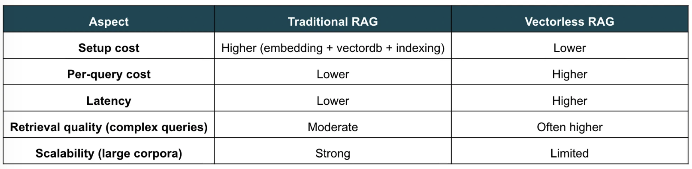

# Vectorless RAG: A Reasoning-Based Document Retrieval System

## 출처
본 저장소는 아래 출처의 자료를 수정한 것입니다.
- https://pub.towardsai.net/vectorless-rag-how-i-built-a-rag-system-without-embeddings-databases-or-vector-similarity-efccf21e42ff
- https://github.com/alphaiterations/agentic-ai-usecases/tree/main/advanced/vectorless-rag


### Intro

RAG는 비공개 데이터에 대한 질문에 답변할 수 있는 AI 시스템을 구축하는 데 있어 핵심적인 패턴으로 자리 잡았음. 기존 RAG는 벡터 임베딩을 활용해 관련 텍스트 청크을 검색한 뒤, 이를 llm에 전달하여 내용을 생성하는 방식.

그러나 시스템이 확장되고 복잡해짐에 따라, **‘추론 기반 검색(Reasoning-based retrieval)’**으로도 알려진 **‘벡터리스 RAG’**라는 새로운 패러다임이 등장

벡터리스 RAG는 임베딩과 유사도 검색에 의존하는 대신, 인간이 정보를 탐색하듯이 구조를 따르고 단계별로 추론하며 다음에 어디를 살펴볼지 동적으로 결정.

이 글에서는 다음 내용을 다룸

- 벡터리스 RAG란 무엇인가
- 기존 RAG와의 비교
- 장점과 단점
- 사용해야 할 때와 사용하지 말아야 할 때

### 전통적인 방식의 RAG

- chunking: 문서를 작은 단위로 분할
- embedding: 각 청크를 벡터로 변환
- retrieval: 유사도 검색(예: 코사인 유사도)을 사용하여 관련 청크를 찾아냄

그다음

- Top-k 청크를 LLM에 보냄
- LLM이 답변을 생성

```python
Query → Embedding → Vector DB → Top-k Chunks → LLM → Answer
```

시간이 지나면서, 특히 검색 품질, 추론 깊이, 문맥 관련성 등 기존 RAG의 한계를 해결하기 위한 여러 변형들이 등장함. (ReRanking, Agentic RAG, Hybrid RAG)

1. Re-ranking RAG는 LLM을 활용해 초기 검색된 문서의 순서를 재정렬하는 두 번째 단계를 도입하여 검색 정확도를 향상시킴. 시스템은 단순한 유사도 점수만을 신뢰하는 대신, “이 결과들 중 실제로 쿼리와 가장 관련성이 높은 것은 무엇인가?”라고 질문함….
2. 하이브리드 RAG는 여러 검색 전략을 결합함. 일반적으로 dense 벡터 검색과 BM25와 같은 키워드 기반 방법을 결합. 이는 임베딩의 주요 약점, 즉 정확한 일치 항목(예: ID, 이름, 희귀 용어)을 놓칠 수 있다는 점을 극복하는 데 도움이 되며, 반면 키워드 검색만으로는 의미적 이해가 부족하다는 단점을 보완.
3. 에이전트형 RAG는 파이프라인에 반복적 추론을 도입함. 시스템은 한번 조회하지 않고 다음과 같이 수행
    - 쿼리를 하위 질문(sub-question)으로 분해
    - 여러 단계의 검색 수행(multiple retrieval steps)
    - 다음에 어떤 정보를 가져올지 동적으로 결정(decide dynamically what information to fetch next)
    

**이로 인해 `검색과 추론의 경계가 모호`해지기 시작하며, 시스템은 `더 유연해지지만 동시에 더 복잡`해집니다.**

### 전통 RAG 방식의 한계(좀 더 세밀한 관점)

기존 RAG는 많은 사용 사례, 특히 대규모로 의미적으로 유사한 콘텐츠를 검색할 때 효과적임. 

하지만 그 한계에 대해서는 종종 오해가 있음. 근본적인 결함이 있는 것이 아니라, 대부분의 문제는 검색이 수행되는 방식과 최적화 대상에서 비롯됨.


1. **Shallow retrieval (핵심적 한계)**
- 기존 RAG의 가장 근본적인 한계는 검색이 과제 관련성(Task relevance)나 추론이 아닌 의미적 유사성(Semantic similarity)에 기반한다는 점
- **벡터 검색은 다음과 같은 질문에 답변함**
    - “어떤 텍스트가 쿼리와 유사해 보이나?”
- **그러나 실제 많은 쿼리에서는 다음이 필요함**
    - 인과 관계 이해
    - 다단계 추론
    - 여러 섹션에 걸친 정보 통합
- 그 결과, 주제와 관련이 있지만 실제로 질문에 답하는 데는 유용하지 않은 텍스트를 검색해 올 수 있음
- 이는 임베딩 기반 검색의 본질적인 한계이며, 더 나은 청크화나 색인화(indexing)만으로는 완전히 해결할 수 없음

2. **Context Fragmentation/문맥 단절 (완화 가능)**
- 문서는 일반적으로 임베딩 전에 여러 조각으로 분할됨. 이로 인해 다음과 같은 상황이 발생할수 있음:
    - 중요한 문맥이 여러 조각에 걸쳐 분할됨
    - 검색된 조각에 충분한 주변 정보가 부족함
    - 섹션 간의 관계가 상실됨
- 그러나 이는 근본적인 한계가 아니라 주로 기술적인 문제입니다. 다음과 같은 기법으로 완화 가능:
    - Overlapping chunks
    - Sliding windows
    - re-ranking
    - multi-hop retrieval

3. **Loss of Structure/구조의 상실 (구현 방식에 따라 다름)**
- 단순한 구현 방식에서는 문서가 여러 chunk로 평면화되어 원래의 구조(장, 절, 소절)가 사라짐.
- 그러나 최신 RAG 시스템은 다음과 같은 방법을 사용하여 구조를 보존하는 경우가 많음:
    - 메타데이터(예: 절 제목, 계층 구조)
    - hierarchical chunking
    - parent-child retrieval strategies
- 적절하게 구현될 경우, 전통적인 RAG는 문서의 구조를 상당 부분 유지할 수 있음.
- 따라서 이는 본질적인 한계가 아니라, 지나치게 단순화된 파이프라인의 결과일 뿐.

4. **전처리 오버헤드 (아키텍처 상의 절충점)**
- 기존 RAG는 다음을 필요로 함:
    - 임베딩 생성
    - 벡터 데이터베이스 저장
    - 인덱싱 및 유지 관리
- 이는 초기 비용과 시스템 복잡성을 초래하지만, 다음과 같은 이점을 제공:
    - 빠른 검색
    - 저지연 쿼리
    - 확장 가능한 성능
- 이는 진정한 한계라기보다는 비용 분배의 trade-off로 이해하는 것이 가장 적절:
    - 높은 초기 비용
    - 낮은 쿼리당 비용

**핵심 요점**

흔히 언급되는 여러 문제점 중 유일한 근본적인 한계는  기존 RAG가 추론이 아닌 유사성을 기반으로 검색을 수행한다는 점뿐이다.

그 외의 모든 문제, 즉 구조, 분절화, 비용 등은 더 나은 시스템 설계를 통해 해결할 수 있다.

이 구분은 검색을 단순한 유사성 문제에서 의사결정 과정으로 전환하려는 벡터리스(추론 기반) 검색과 같은 새로운 접근 방식과 기존 RAG를 비교할 때 중요하다.


### Vectorless RAG: The Core Idea

기존 RAG의 주된 한계가 검색 과정에 추론이 결여되어 있다는 점이라면, 자연스럽게 다음과 같은 질문이 떠오름.

```python
만약 검색 자체에 추론 능력이 있다면 어떨?
```

이를 이해하기 위해, 인간 분석가가 문서를 어떻게 다루는지 생각해 보자.

그들은 수천 개의 문장 조각을 훑어보거나 유사도에만 의존하지 않습니다. 대신 다음과 같은 과정을 거친다.

- 목차를 살펴본다.
- 문서의 구조를 파악한다.
- 추론한다: “X에 대한 정보가 필요하다면, 아마도 Y 섹션에 있을 것이다”
- 해당 섹션으로 바로 이동한다
- 전체 맥락을 읽는다
- 답변을 종합한다.

이 과정은 체계적이고, 의도적이며, 반복이다. 검색은 일회성 작업이 아니다. 모든 단계에서 추론에 의해 안내된다.

벡터리스 RAG는 바로 이 개념을 기반으로 구축되다.

유사성에 기반해 검색하는 대신, 검색을 의사결정 과정으로 취급한다. 

이 시스템은 다음을 학습한다:

- 문서 구조 해석
- 다음으로 이동할 위치 결정
- 검색 범위를 점진적으로 좁혀감
- 충분한 맥락이 확보되었을 때만 콘텐츠 검색

즉, 검색 방식을 다음과 같이 전환한다:

```python
“무엇이 비슷해 보이나?”
```

에서

```python
“다음에 어디로 가야 할까?”
```

로 전환한다. 이것이 바로 벡터리스 RAG를 정의하는 근본적인 변화이다.


### **How It Works in Practice**

벡터리스 RAG는 유사도 기반 검색을 구조화된 추론 중심 프로세스로 대체. 

이는 두 단계로 이루어집니다: `일회성 문서 변환`과, 그 후 `쿼리 시점에 수행되는 추론 기반 검색 루프`.

#### 1단계: 문서 트리 구축 (일회성 설정)

쿼리를 처리하기 전에 문서를 계층적 구조로 변환함

개념적으로 이는 책이 구성되는 방식과 유사함

- 제목(title)
- 장(chapters)
- 절(sections)
- 소절(subsections)

전처리 단계(예: PageIndex)를 통해 문서는 트리 형태로 파싱되며, 각 노드에는 다음이 포함됩니다:

- 제목(title)
- 짧은 요약(short summary)
- 페이지 경계(page boundaries)
- 선택적으로, 전문(full text)

이를 통해 다음과 같은 구조가 생성됩니다:

```python
{
  "title": "Google Bigtable Paper",
  "node_id": "0001",
  "summary": "Introduction to Bigtable architecture",
  "nodes": [
    {
      "title": "Data Model",
      "node_id": "0002",
      "summary": "Rows, columns, timestamps",
      "nodes": [...]
    },
    {
      "title": "Architecture",
      "node_id": "0003",
      "summary": "Master, tablet servers, Chubby",
      "nodes": [...]
    }
  ]
}
```

이 트리는 문서를 간결하고 체계적으로 표현한 것으로, 전체 텍스트를 훑어보지 않고도 내용을 탐색할 수 있게 해줌.

#### 2단계: 구조에 대한 추론

쿼리 시점에 시스템은 즉시 텍스트를 검색하지 않는다. 

대신, 먼저 문서 구조에 대해 추론을 수행한다. 그 과정은 다음과 같다:

1. LLM에 다음 정보를 제공한다:
- 쿼리
- 트리 구조 (제목 + 요약만 포함)

2. 모델에게 다음과 같이 질문한다:
- “어떤 섹션에 답이 포함되어 있을 가능성이 가장 높습니까?”

3. 그러면 모델은 다음을 기반으로 관련 노드를 선택한다:
- 쿼리에 대한 의미적 이해
- 고수준 문서 구조
- 섹션 간의 관계

예를 들어, Bigtable의 Chubby에 대한 질문의 경우, 모델은 다음을 선택할 수 있다:

- “아키텍처”
- “일관성 및 동기화”

이 단계는 벡터 유사성을 명시적인 의사 결정으로 대체한다.

#### 3단계: 전체 컨텍스트 검색(Retrieve Full Context)

관련 섹션이 식별되면:

- 시스템은 해당 노드의 전체 텍스트를 검색한다.
- 완전성을 위해 선택적으로 하위 섹션을 포함한다.
- 이들을 구조화된 컨텍스트로 결합한다.

이를 통해 검색이 임의의 단위가 아닌 섹션 단위로 이루어지도록 보장합니다.

#### 4단계: 답변 생성

마지막으로, 검색된 컨텍스트를 LLM에 전달하여 답변을 생성한다.

모델은 다음 지침을 따른다:

- 제공된 컨텍스트만 사용
- 여러 섹션에 걸친 정보를 종합(Synthesize)
- 선택적으로 출처 인용

이 단계는 기존의 RAG와 유사하지만, 핵심적인 차이점은 컨텍스트가 선택된 방식에 있다.


### 벡터 RAG와의 비교 (실무적 관점)

차이를 설명하기 위해 다음 질문을 살펴보자.

```python
“Bigtable은 복제본 간 일관성을 어떻게 처리하나요?”
```

#### 기존 RAG

- “일관성”, “복제”와 같은 용어와의 유사성을 기반으로 청크를 검색.
- 부분적으로만 관련성이 있는 청크를 반환.
- 생성 과정에서 모델이 노이즈를 필터링해야 함.

#### 벡터리스 RAG

- 먼저 관련 섹션(예: “일관성 및 동기화”)을 식별
- 전체 섹션을 검색
- 더 일관되고 집중된 맥락을 제공

### 벡터리스 RAG가 유용한 경우와 그렇지 않은 경우

벡터리스 RAG는 다음과 같은 경우에 유리할 수 있다:

- 문서의 구조가 명확한 경우
- 질문이 섹션 간 이동을 필요로 하는 경우
- 맥락이 관련 하위 섹션에 분산되어 있는 경우

그러나 항상 더 나은 것은 아니다.

#### 장단점

- 더 높은 지연 시간: 쿼리당 여러 번의 LLM 호출
- 벡터 조회 대비 쿼리당 비용이 더 높음
- 구조의 품질에 의존: 구조가 취약하거나 노이즈가 많으면 효과 감소
- 대규모의 비정형 코퍼스에는 적합하지 않음

### 코스트, 성능 고려 사항



#### 핵심 요점

벡터리스 RAG는 기존의 RAG를 대체하는 것이 아니라, 검색 전략을 전환하는 것임.

- 기존 RAG: 효율적, 유사도 기반, 확장성 우수
- 벡터리스 RAG: 구조화됨, 추론 기반, 선택적

두 방식 중 어떤 것을 선택할지는 문제에 따라 달라집니다:

- 대규모 검색 → 벡터 RAG
- 구조화된 문서에 대한 추론 → 벡터리스 RAG


## 구현

### 1단계: 트리 생성

- 벡터 없는 검색 파이프라인의 첫 번째 단계는 문서를 구조화되고 탐색 가능한 형태로 변환하는 것임.
- 문서를 단순한 텍스트로 취급하는 대신, 문서의 논리적 구성을 반영하는 계층적 트리를 구축.

- 이를 위해 PyMuPDF를 기반으로 구축된 경량 라이브러리인 pymupdf4llm을 사용.
- 이 라이브러리는 PDF 파싱 기능을 제공하며, 제목과 구조를 유지한 채 콘텐츠를 마크다운 형식으로 추출할 수 있음.

[PageIndex](https://github.com/VectifyAI/PageIndex)와 같이 바로 사용할 수 있는 솔루션도 있어 구조화된 문서 표현을 생성할 수 있음. 하지만 이 구현에서는 파싱, 계층 구조, 메타데이터를 완전히 제어하기 위해 자체 트리를 구축.

#### 핵심 개념

여기서는 다음과 같은 트리를 구성:

- 각 노드는 섹션(장, 소절 등, chapter, subsection)을 나타냄.
- 노드는 마크다운 헤더(#, ##, ###, …)에서 파생됨.
- 부모-자식 관계는 문서 구조를 반영
- 각 노드는 페이지 범위 및 콘텐츠에 매핑됨

#### 파싱 전략

구현은 다음 세 가지 주요 단계를 따릅니다:

1. **구조화된 마크다운 추출**
- 레이아웃과 제목을 보존하기 위해 pymupdf4llm.to_markdown()을 사용
2. **헤더를 기반으로 계층 구조 구축**
- 마크다운 헤더는 레벨로 파싱되며, 스택 기반 접근 방식을 사용하여 트리를 구성.
3. **콘텐츠를 페이지와 정렬**
- 페이지 단위 청크를 사용하여 페이지 경계를 정교화하고 각 노드가 원본 문서에 정확하게 매핑되도록 보장

추가 사항:

- 제목은 분류됨(번호 매김, 로마 숫자, 번호 없음 등).
- 콘텐츠는 상위 레벨 노드에서 요약됨.
- 리프 노드는 가장 상세한 콘텐츠를 유지.

그 결과로 생성되는 것은 DocumentTree. 이는 PDF를 구조화된 형태로 표현한 것으로, 탐색, 쿼리 및 추론이 가능.

```
tree.py 파일 참고
```

### Step 2: Retrieval (트리 네비게이션)

구조화된 DocumentTree가 준비되면 다음 단계는 검색이다. 

일회성 조회를 수행하는 대신, 모델이 다음으로 이동할 위치를 결정하도록 하여 트리를 단계별로 탐색한다.

이는 langgraph를 사용한 에이전트 기반 탐색 루프로 구현되며, 각 단계에서는 현재 노드를 분석하여 다음 중 하나를 결정한다:

- 현재 노드에서 콘텐츠를 검색하거나,
- 자식 노드 중 하나로 하향 이동합니다

#### 핵심 개념

검색은 트리에 대한 의사결정 과정으로 간주된다:

- 루트에서 시작
- 각 노드에서 쿼리와의 관련성을 평가
- 다음 중 하나를 선택:
    - 중지하고 콘텐츠를 추출하거나,
    - 더 관련성이 높은 하위 섹션으로 더 깊이 이동

이는 중지 조건(낮은 신뢰도, 최대 깊이, 또는 리프 노드)이 충족될 때까지 계속된다.

#### 구현 구성 요소

검색 파이프라인은 다음 네 가지 주요 단계로 구성된 그래프로 구축된다:

1. 분석 (LLM 기반 의사결정)
모델은 다음 정보를 입력받는다:
    - 쿼리
    - 현재 노드 (제목, 요약, 콘텐츠 미리보기)
    - 자식 노드 목록
    
    모델은 다음을 리턴한다:
    
    - 신뢰도 점수
    - 하위로 이동할지 여부
    - 다음에 탐색할 자식 노드
    - 간략한 추론
2. 하위 탐색 (트리 탐색, tree traversal)
선택된 자식 노드로 이동하여 과정을 반복
3. 검색(콘텐츠 추출)
트래버스가 중단되면 시스템은 페이지 메타데이터와 함께 현재 노드에서 콘텐츠를 추출.
4. 생성(최종 답변)
검색된 섹션은 모델로 전달되어 인용 출처가 포함된 근거 기반 답변을 생성합니다.

#### 실행 흐름

```python
Question
   ↓
[Step 1] Analyze Node      ← LLM evaluates relevance and decides next action
   ↓
[Step 2] Route Decision    ← Descend into children, retrieve content, or backtrack
   ↓
[Step 3] Retrieve Content  ← Extract full text from relevant nodes
   ↓
[Step 4] Generate Answer   ← LLM synthesizes final answer with sources
   ↓
Answer + Path + Confidence + Sources
```

각 단계(step)에서는 다음을 포함한 정보가 로깅된다:

- 탐색 경로(Traversal path)
- 각 노드에서 내린 결정(Decisions made at each node)
- 신뢰도 점수(Confidence scores)
- 최종적으로 사용된 출처(Final sources used)

이를 통해 블랙박스 검색 시스템과 달리 검색 과정이 완전히 투명해지고 디버깅이 가능해짐

#### 주요 특징

- 검색은 일회성이 아닌 반복적으로 수행
- 결정은 명시적이며 검토 가능함
- 탐색은 구조와 추론을 기반으로 안내됨
- 시스템은 광범위한 블록 대신 관련성 높은 하위 섹션에 자연스럽게 집중함

```python
retriever.py 파일 참고
```

### main.py 구현하기

다음 명령 실행

```python
uv run main.py
```

가장 먼저 pymupdf4llm을 사용해서 pdf로부터 텍스트를 추출한다.

다음과 같은 형태일 것이다.

```python
{
  "document_name": "bigtable-osdi06",
  "root": {
    "id": "root",
    "title": "bigtable-osdi06.pdf",
    "level": 0,
    "page_start": 1,
    "page_end": 13,
    "content": "",
    "children": [
      {
        "id": "Bigtable_A_Distribut_0",
        "title": "**Bigtable: A Distributed Storage System for Structured Data**",
        "level": 1,
        "page_start": 1,
        "page_end": 13,
        "content": "\n\nFay Chang, Jeffrey Dean, Sanjay Ghemawat, Wilson C. Hsieh, Deborah A. Wallach Mike Burrows, Tushar Chandra, Andrew Fikes, Robert E. Gruber \n\@google.com">n{fay,jeff,sanjay,wilsonh,kerr,m3b,tushar,fikes,gruber}@google.com \n\n_Google, Inc._",
        "children": [
          {
            "id": "Abstract_8",
            "title": "**Abstract**",
            "level": 2,
            "page_start": 1,
            "page_end": 1,
            "content": "\n\nBigtable is a distributed storage system for managing structured data that is designed to scale to a very large size: petabytes of data across thousands of commodity servers. Many projects at Google store data in Bigtable, including web indexing, Google Earth, and Google Finance. These applications place very different demands on Bigtable, both in terms of data size (from URLs to web pages to satellite imagery) and latency requirements (from backend bulk processing to real-time data serving). Despite these varied demands, Bigtable has successfully provided a flexible, high-performance solution for all of these Google products. In this paper we describe the simple data model provided by Bigtable, which gives clients dynamic control over data layout and format, and we describe the design and implementation of Bigtable.",
            "children": [],
            "heading_type": "unknown",
            "summary": "Bigtable is a distributed storage system for managing structured data that is designed to scale to a very large size: petabytes of data across thousands of commodity servers. Many projects at Google store data in Bigtable, including web indexing, Google Earth, and Google Finance. These applications "
          },
          {
            "id": "1_Introduction_12",
            "title": "**1 Introduction**",
            "level": 2,
            "page_start": 1,
            "page_end": 1,
            "content": "\n\nOver the last two and a half years we have designed, implemented, and deployed a distributed storage system for managing structured data at Google called Bigtable. Bigtable is designed to reliably scale to petabytes of data and thousands of machines. Bigtable has achieved several goals: wide applicability, scalability, high performance, and high availability. Bigtable is used by more than sixty Google products and projects, including Google Analytics, Google Finance, Orkut, Personalized Search, Writely, and Google Earth. These products use Bigtable for a variety of demanding workloads, which range from throughput-oriented batch-processing jobs to latency-sensitive serving of data to end users. The Bigtable clusters used by these products span a wide range of configurations, from a handful to thousands of servers, and store up to several hundred terabytes of data. \n\nIn many ways, Bigtable resembles a database: it shares many implementation strategies with databases. Parallel databases [14] and main-memory databases [13] have \n\nachieved scalability and high performance, but Bigtable provides a different interface than such systems. Bigtable does not support a full relational data model; instead, it provides clients with a simple data model that supports dynamic control over data layout and format, and allows clients to reason about the locality properties of the data represented in the underlying storage. Data is indexed using row and column names that can be arbitrary strings. Bigtable also treats data as uninterpreted strings, although clients often serialize various forms of structured and semi-structured data into these strings. Clients can control the locality of their data through careful choices in their schemas. Finally, Bigtable schema parameters let clients dynamically control whether to serve data out of memory or from disk. \n\nSection 2 describes the data model in more detail, and Section 3 provides an overview of the client API. Section 4 briefly describes the underlying Google infrastructure on which Bigtable depends. Section 5 describes the fundamentals of the Bigtable implementation, and Section 6 describes some of the refinements that we made to improve Bigtable\u2019s performance. Section 7 provides measurements of Bigtable\u2019s performance. We describe several examples of how Bigtable is used at Google in Section 8, and discuss some lessons we learned in designing and supporting Bigtable in Section 9. Finally, Section 10 describes related work, and Section 11 presents our conclusions.",
            "children": [],
            "heading_type": "unknown",
            "summary": "Over the last two and a half years we have designed, implemented, and deployed a distributed storage system for managing structured data at Google called Bigtable. Bigtable is designed to reliably scale to petabytes of data and thousands of machines. Bigtable has achieved several goals: wide applica"
          },

}
```


### 벡터리스 RAG의 실용적 측면

위의 구현 및 실행 추적을 통해, 벡터리스 검색 시스템을 구축할 때 몇 가지 실용적인 고려 사항이 두드러집니다.

#### 1. 구조의 품질이 중요하다.

모든 것은 문서가 트리로 얼마나 잘 파싱되느냐에 달려 있다.

- 깔끔한 제목 → 더 나은 탐색
- 노이즈가 많은 PDF → 불확실한 트래버설(검색) 결정
- 계층 구조 누락 → 평면적이고 비효율적인 검색

실제로, 우수한 파싱(레이아웃 + 헤더)에 투자하는 것은 검색 품질에 직접적인 영향을 미친다.

#### 2. 노드 세분화는 핵심적인 절충점

노드를 어떻게 정의하느냐에 따라 정확도와 성능 모두에 영향을 미친다.

- 너무 굵은 세분화 (큰 섹션)→ 덜 정확한 답변
- 너무 세분화된 상태(아주 작은 단위)→ 더 깊은 탐색, 더 많은 LLM 호출

균형 잡힌 계층 구조(섹션 → 하위 섹션 → 리프)가 가장 효과적.

#### 3. 탐색 깊이 vs 지연(latency)

다음 결과 예시를 보자.

```python
Total LLM calls : 4  (3 navigate + 1 answer)
Total latency   : 15.60s
```

탐색 단계가 하나 추가될 때마다 지연 시간이 발생.

실제 시스템에서는 다음을 수행해야 한다:

- 최대 깊이 제한
- 중지 임계값(신뢰도) 조정
- 불필요한 탐색 방지

#### 4. 프롬프트 설계가 동작을 좌우한다.

탐색의 품질은 탐색 프롬프트에 크게 좌우됨:

- 명확한 지시 → 더 나은 결정
- 모호한 프롬프트 → 무작위 탐색

사소한 변경(예: “should_descend”의 정의 방식)만으로도 결과에 큰 영향을 미칠 수 있습니다.

#### 5. 로깅은 선택 사항이 아니고 필수

로깅의 가장 큰 장점 중 하나는 가시성(Visibility):

- 시스템이 정확히 어디로 이동했는지 확인할 수 있음
- 시스템이 왜 특정 결정을 내렸는지 디버깅할 수 있음
- 실제 추적 기록을 바탕으로 동작을 조정할 수 있음

로그 없이 다음만 있다면

```python
Decision   : ↓ descend
Reasoning  : The Introduction section directly addresses the query
```

성능 향상이 어렵다.

#### 6. 구조화된 문서에 가장 효과적

이 접근 방식은 다음과 같은 경우에 잘 작동함:

- 문서에 명확한 섹션이 있을 때 (논문, 보고서, 문서)
- 정보가 논리적으로 구성되어 있을 때

다음과 같은 경우에는 효과가 떨어짐:

- 콘텐츠가 비구조화되어 있을 때 (로그, 채팅, 정리가 안 된 텍스트)
- 따를 만한 의미 있는 계층 구조가 없을 때

#### 7. 여전히 양질의 콘텐츠가 필요하다.

당연한 말처럼 들리지만, 여기서는 더욱 중요함:

- 올바른 정보가 명확히 정의된 섹션에 없다면
- 시스템은 “의미론적 대체 방안”을 갖지 못한다.

따라서 콘텐츠 구성은 시스템 설계의 일부가 된다.

**벡터리스 RAG는 모든 곳을 검색하는 것에서 지능적으로 탐색하는 것으로 초점을 전환합니다.**

### 결론

벡터리스 RAG는 검색을 일회성 조회(one-shot lookup)가 아닌 안내된 프로세스로 재구성한다. 

문서 구조를 보존하고 단계별로 탐색함으로써, 시스템은 어디로 갈지, 언제 멈출지, 무엇을 추출할지 등의 명시적인 결정을 통해 답변을 구축한다. 그 결과, 구조화된 데이터에 효과적일 뿐만 아니라 투명하고 추론하기 쉬운 파이프라인이 만들어진다.

실제 적용에 있어 이는 기존 RAG와 벡터리스 RAG 중 하나를 선택하는 문제가 아니다. 이들은 서로 다른 아키텍처적 선택을 나타낸다. 문제에 따라 한 방식이 다른 방식을 보완하거나, 심지어 동일한 시스템 내에서 공존할 수도 있다. 이 접근 방식이 강조하는 점은 검색이 반드시 유사성에만 의존할 필요는 없으며, 구조, 탐색, 그리고 통제된 추론으로부터도 도출될 수 있다는 것이다.

#### **References:**

- [PageIndex Framework (Vectorless RAG)](https://github.com/VectifyAI/PageIndex).
- [Vectorless RAG](https://www.geeksforgeeks.org/artificial-intelligence/vectorless-rag-pageindex/)
- [Bigtable: A Distributed Storage System for Structured Data](https://static.googleusercontent.com/media/research.google.com/en//archive/bigtable-osdi06.pdf)
- [Alpha Iterations Vectorless RAG Repo](https://github.com/alphaiterations/agentic-ai-usecases/tree/main/advanced/vectorless-rag)