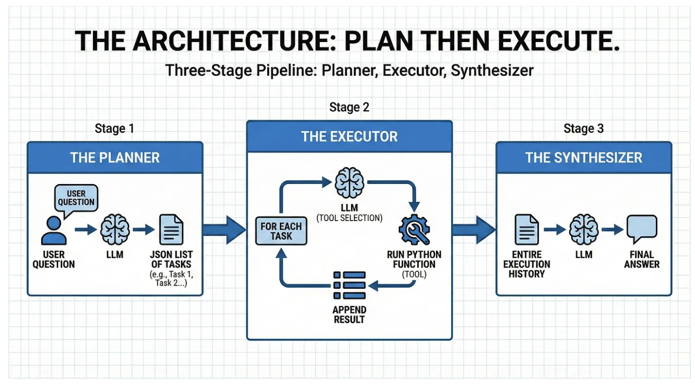

# Building an AI Agent from Scratch with pure Python
- https://levelup.gitconnected.com/building-an-ai-agent-from-scratch-with-pure-python-7d4532202637
- https://github.com/cbernecker/AIAgentScratch/blob/master/Readme.md

## AIAgent.py

AIAgent.py는 구조화된 ‘계획-실행(Plan-and-Execute)’ 방식의 AI 에이전트를 구현합니다.   
이 에이전트는 복잡한 사용자 질문을 순차적이고 간단한 작업들로 분해하도록 설계되었습니다.   
그런 다음 사용 가능한 도구 세트를 활용하여 이러한 작업을 실행하고, 그 결과를 바탕으로 간결한 최종 답변을 도출합니다.   

### 작동 원리
1. 계획 수립: 에이전트는 먼저 사용자의 프롬프트를 실행 가능한 단계 목록으로 분해하여 작업을 계획합니다.
2. 도구 실행: 그런 다음 각 작업을 수행하기 위해 available_functions에서 적절한 도구를 식별하고 호출하며, 작업 간의 종속성을 처리합니다.
3. 정리: 마지막으로, 도구 실행 결과와 원래의 사용자 프롬프트를 종합하여 포괄적인 답변을 제공합니다.

## AIReactAgent.py
AIReactAgent.py는 ReAct(추론 + 실행) 루프의 핵심 논리를 구현합니다. 정적 플래너와 달리, 이 에이전트는 결론에 도달하거나 시간 초과가 발생할 때까지 ‘사고(Thought)’, ‘행동(Action)’, ‘관찰(Observation)’의 연속적인 루프를 동적으로 반복합니다.

### 작동 원리
1. 초기화: 시스템 프롬프트와 사용 가능한 도구(tools)를 불러옵니다.
2. 루프 실행 (react_agent):
- 사고(Thought): LLM을 호출하여 현재 대화 이력을 기반으로 다음 단계를 생성합니다.
- 행동(Action): LLM의 출력을 분석하여 호출할 특정 도구(예: get_planet_mass)와 그 인수를 식별합니다.
- 관찰(Observation): 도구를 실행(execute_tool을 통해)하고 출력(또는 오류 메시지)을 캡처합니다.
- 수정: LLM이 예상된 형식을 위반할 경우, 에이전트가 오류 메시지를 추가하여 이를 수정합니다.
3. 종료: LLM이 “최종 답변”을 제공하거나 max_turns에 도달하면 중단됩니다.
